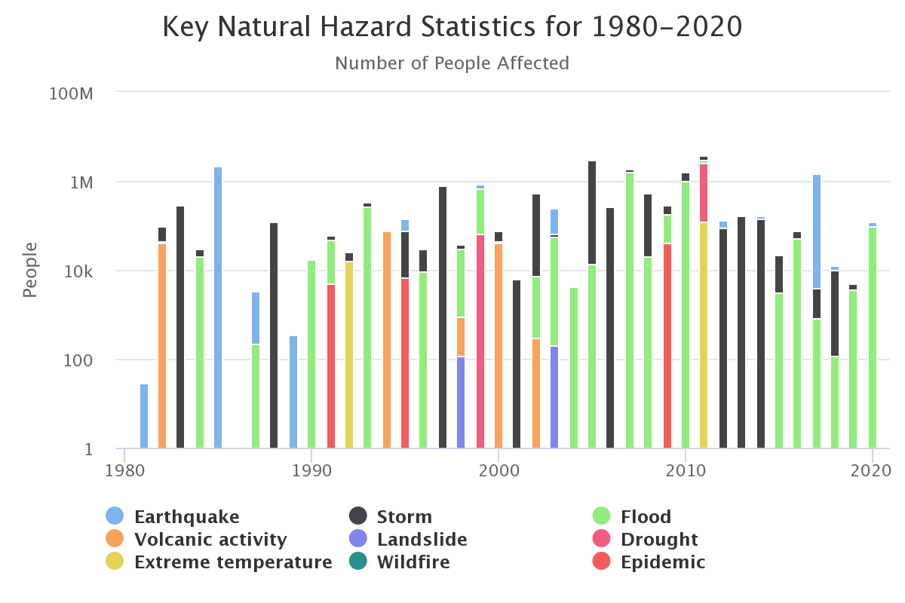

## Mapping uninsurables

Mexico has seen many severe floodings in the past 20 years, including 2010, 2020, July 2021, August 2022, see **Fig 1**. 

According to the official statistics, in Mexico the most prominent physical risks are floodings and Severe Storms.

**Fig 1** Source : [The World Bank](https://climateknowledgeportal.worldbank.org/country/mexico/vulnerability)

More than 25% of flooded properties are situated outside areas designated as being flood prone [**[1](https://www.morganclark.co.uk/about-us/blog/uk-flood-statistics-facts-about-flooding/)**]. This huge number shows the urgent need for an update and redefinition of flood prone areas.

Multiple research stated that the inefficiency of the system in preventing damage 
caused by floods in Mexico is due to both the lack of high-level expertise in hazard maps 
design and the lack of their use in decision-making policies at the local level [[2](https://www.mdpi.com/2073-4433/10/8/424), ]

### Supporting the Climate adaptation

With millions of properties at risk from flooding and the number set to rise, this problem with flood prevention should be managed and coordinated at the national level. Millions of people are trapped in a home which they can’t sell. They can’t afford buying another home and are in danger due to high flood risk.

And this is not just a problem for those who already live in a flood risk area! 
To remind, **25% of flood events occurred outside** the official flood risk areas.  Each flood-defence scheme is a big  project worth of millions of  US dolars.

With this study we want to go beyond risk mapping and exposure alert. 
Detailed evaluation of the expected losses is a strong argument for further adaptation fund allocations. This study will  focus on the local scale, i.e. on the level of individual buildings. Explicit risk information should enable communities, companies, and people to prepare for disasters. Currently since such detailed data are hardly available.

### Services proposed

1. Physical climate risk loss modelling and mapping 
2. Focus on 6 hazard types : pluvial flood, coastal flood, drought, heat wave (extreme temperature), severe storm, landfall.
3. Risk rating using commercial insurance logic : no risk - insurable - uninsurable. 
This approach should put on light the most fragile areas. 
100 x 100 meter resolution risk mapping.
4. Open Source methodology for risk rating : no risk - insurable - uninsurable. 
Uninsurable means unaffordable for an average household.
5. Virtual city map = Open Data risk rating  = interactive vulnerability map
6. Open Source code 
7. Integration of multi-model approach using the most recent climate model data ([CMIP6](https://www.wcrp-climate.org/wgcm-cmip/wgcm-cmip6)) and also the recent high resolution satellite hazard mapping data, e.g. by the [ESA](https://www.esa.int/Applications/Telecommunications_Integrated_Applications/Satellite_flood_maps_reach_crisis_teams_via_Internet). “Multi-model” means much bigger data sample compared to limited observational record.
8. Forward-looking flood risk assessment, as well as for the other 4 hazard types. Focus on 5-30-year horizon. Multi-model approach using the most recent model data (CMIP6).
9. Multi-model approach allows for uncertainty assessment.
10. Activating and supporting the local initiatives to accelerate and promote risk prevention strategies. More effort and more responsibility should be asked from the Government and local authorities. NGOs and landlords need efficient and comprehensible tools and support.
11. The UK banks and the London Stock Exchange Group ask for data and tools for credit risk assessment.

### Planned Impact

Our goal is to use modern hydrological and meteorological tools to develop and assess a methodology for end-to-end flood risk assessment based on modelling the specific impacts at each location and each time step.
Historical and forward-looking, with scenario analysis for climate change.
The spatial extent and recurrence of flooding should be translated into sector-specific consequences.
Via financial modelling we .

In contrast to European countries, Mexico does not benefit yet from the advanced mitigation engineering projects, although with many vulnerable communities.

### Key words

Physical climate risk, human rights, social policy, sustainable, democratisation of risk data knowledge, inclusive flood insurance, preventive flood protection, reduction of impacts induced by flooding, drought and heat waves.

### Long-term vision
This use case will become the pilot project for further commercial product development for the national level and progressively for other countries. 

### About the Company

This project is the partnership between three companies in four countries.
**JH** is an R&D company based in Mexico, specialised in climate impact assessment and financial risk modeling.
[Weather Trade Net](https://www.weathertrade.net/) is a UK technology company specialised on physical climate risk modeling and the corporate compliance with new climate regulatory policy.
The [ClimateRadar](https://www.climateradar.com/) is a Scientific initiative on Climate data validation and analytics.