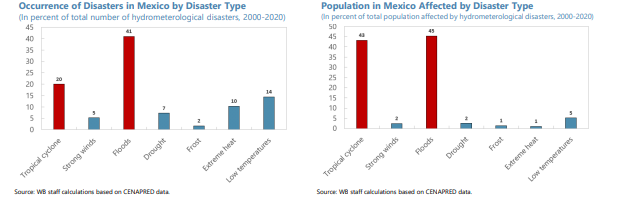
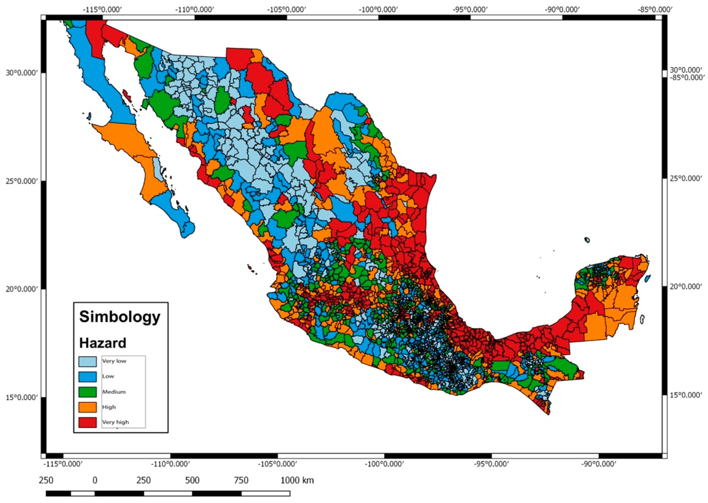
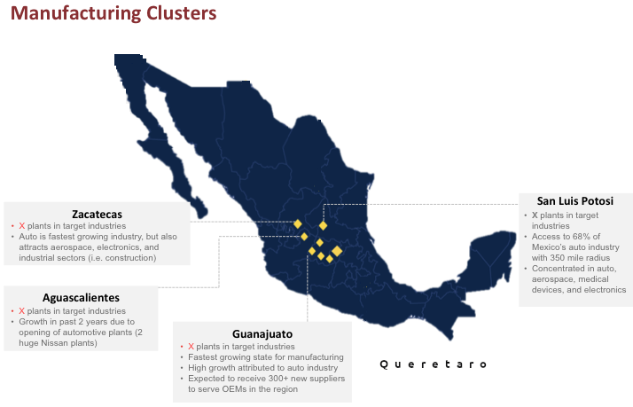

## Mapping uninsurables

Author : [Jorge Hinojosa Garza](https://www.linkedin.com/in/jorge-hinojosa-54aa6520/)

### Avant Propos

Business interruptions, property loss, asset devaluation, credit risk, drinking water shortage - these are just a few examples of impacts of physical climate risks.
These impacts trigger long-term cascading damage to the environment, biodiversity, populations and all economic activities, even outside the impacted area. 
All these components are interconnected through supply chains, water usage restrictions, pollution, the electricity consumptions and kwh electricity pricing. 

For insurance companies these physical climate risks are material, as well as for the property owners, risk managers, farmers and industrial companies. 
The availability of insurance is critical information for the property valuation. 
Insurance is one of the key arguments for policymakers, for tax regulators and for business decisions.
The availability and the pricing of the insurance policy can be used efficiently for mapping the priority regions for climate adaptation action.

The locations most vulnerable to severe climate events are uninsurable. 
Climate research has demonstrated that the frequency and intensity of severe events are shifting with increase global warming, resulting in that some areas could become uninsurable and consequently unaffordable. The cost of the premium is calculated as a function of the total number of climate hazards over a long period of time and the worst-case pay-off. The premium is roughly 5-10% of the maximum payoff. For the properties exposed to high risk the annual premium could reach tens of thousands of GBP. 

Already ten years ago the insurance companies started to adjust the in-house climate risk modelling and the thresholds for the pay-off - by applying and removing the multi-year tendencies. Yet, for this forward adjustment, the insurance companies are not using the tendencies from the Global Climate Model experiments. Instead, insurers simply extrapolate the historical number of droughts and floods forward. This assumes a linear relationship between time and physical climate risks, but these are often non-linear due to complex interactions in the physical climate system. 

Other than the cost of insurance, the limitation could arise from the type of hazard and the geography. 
Typically, brokers restrain their offering to NatCat group which includes the massive climate disasters of the century. This means that the insurance policies just don’t consider other hazard types, e.g. the small to medium floods, heat waves, cold air outbreaks, droughts and severe storms. 

Availability of insurance for floods and hurricanes is subject to geography. It is impossible to price the loss without high quality hazard time series that cover a long time span. In the absence of detailed hazard history, the insurance company can’t underwrite the insurance policy. **(Maybe add something that we can provide this)**

Physical climate risk data should be the public good. As for today, the risk data access is asymmetric between communities and the insurance companies. These operate with very different risk maps for floods.
With all the evidence, for knowledgeable decision making, the communities need access to the same resources (maps and data) which are used by insurance companies. **(Maybe clarify a bit more why the communities better access to this data)**

To become valuable, the physical climate risk exposure (the time series of hazards) should be translated into financial metrics.
To do so, **(something is missing here, maybe 'we')** adopted the insurance logic for the physical climate risk assessment. Asset-level : no risk - insurable - uninsurable.

Uninsurable means unaffordable for an average household. 
Mathematically, the risk score is calculated as a damage ratio: the cost of flood damages relative to the total insurance policy cost.
Both costs are integrated over a 30-year mortgage period.
30-years is the duration of a typical home mortgage. **(Not sure what the point is that you are trying to make here)**

### Physical climate risks in Mexico

Mexico has seen many severe floodings in the past 20 years, including 2005 (hurricanes Emily and Wilma), 
2007 (hurricane Stan), 2010, 2013, 2014 (tropical cyclones Ingrid and Manuel), 2020, July 2021, August 2022 [**Fig 1**]. 

Both in terms of the social and economic impact, the most prominent physical risks are floodings and tropical cyclones [**Fig 2**]. 

Over 162,000 km2 (8%) of the Mexican territory are susceptible to flooding, [Bonasia and Lucatello, 2019](https://www.mdpi.com/2073-4433/10/8/424) [**Fig 3**].

**Fig 1** Key natural hazard statistics for 1980-2020 for Mexico. *Source: [The World Bank](https://climateknowledgeportal.worldbank.org/country/mexico/vulnerability)*

**Fig 2**: The estimates are based on data from CENAPRED. *Source: [Mexico: Financial Sector Assessment Program-Technical Note on Climate Risk Analysis, Dec 2022](https://www.imf.org/en/Publications/CR/Issues/2022/12/08/Mexico-Financial-Sector-Assessment-Program-Technical-Note-on-Climate-Risk-Analysis-526754)*

More than a third of flooded properties are situated outside areas designated as being flood prone. This huge number shows the urgent need for an update and redefinition of flood prone areas.
 

**Fig 3**: Areas of flood hazard in Mexico. *Source: [Bonasia and Lucatello, 2019](https://www.mdpi.com/2073-4433/10/8/424)*

### Region of interest

In this impact assessment study we focus on the central corridor : Zacatecas - Aguascalientes - Guanajuato - Queretaro - San Luis Potosi.
It concentrates the largest car, cement, steel, industrial, food and beverage, and big agro-industrial players of the Mexican economy. 

Currently, 90 of the top 100 auto parts companies in the world have production operations in Mexico [[MSCI](https://www.msci.org/how-to-think-about-manufacturing-in-mexico/)].
Eighteen of the main original equipment manufacturers have facilities in Mexico, with 11% of all cars and light trucks sold in the United States manufactured in those facilities. 
According to the Mexican Federation of Aerospace Industry, there are 260 aerospace companies, with 79% focusing on manufacturing.

Together these companies generate almost half of the GDP and are responsible for over 50% of the national GHG emissions.
As the economic growth is coupled to energy consumption, our major focus are the power and the transport sectors.

The focus area is about 300 by 300 km. This region is highly vulnerable to physical climate risks.

**Fig 4**: Study area, focus on Mexican manufacturing industrial clusters.

### State of art on physical climate risk assessment for Mexico

Multiple research stated that the inefficiency of the system in preventing damage 
caused by floods in Mexico is due to both the lack of high-level expertise in hazard maps 
design and the lack of their use in decision-making policies at the local level [[2](https://www.mdpi.com/2073-4433/10/8/424), ]

For impact assessment we will combine the following resources:
* [Desinventar](https://www.desinventar.org/) : data for human and material losses, damages, disasters, and events that have impacted different countries in Latin America
* [Mexican Census of Population and Housing](https://www.inegi.org.mx/programas/ccpv/2020/)
* [Geographic Distribution of GDP and Credit Exposure by Banxico]()

### Supporting the Climate adaptation

With millions of properties at risk from pluvial flooding and the number set to rise, this problem with flood prevention should be managed and coordinated at the national level. Millions of people are trapped in a home which they can’t sell. They can’t afford buying another home and are in danger due to high flood risk.

And this is not just a problem for those who already live in a flood risk area! 
To remind, the third of flood events occurred outside the flood risk areas.  Each flood-defence scheme is a big  project worth of millions of US dollars.

With this study we want to go beyond risk mapping and exposure alert. 
Detailed evaluation of the expected losses is a strong argument for further adaptation fund allocations. This study will  focus on the local scale, i.e. on the level of individual buildings. Explicit risk information should enable communities, companies, and people to prepare for disasters. Currently since such detailed data are hardly available.

### Services proposed

1. Physical climate risk mapping and loss modelling
2. Focus on 6 hazard types : **pluvial flood**, **wildfire**, **landslide**, **heat wave** (extreme temperature), **severe storm**, landfall.
3. Risk rating using commercial insurance logic : **no risk** - **insurable** - **uninsurable**. 
This approach should put on light the most fragile areas. 
1 km x 1 km resolution risk mapping.
4. Open Source methodology for risk rating : no risk - insurable - uninsurable. 
Uninsurable means unaffordable for an average household.
5. interactive vulnerability map and Open Data risk rating 
6. Open Source code 
7. Integration of multi-model approach using the most recent climate model data ([CMIP6](https://www.wcrp-climate.org/wgcm-cmip/wgcm-cmip6)) and also the recent high resolution satellite hazard mapping data, e.g. by the [ESA](https://www.esa.int/Applications/Telecommunications_Integrated_Applications/Satellite_flood_maps_reach_crisis_teams_via_Internet). “Multi-model” means much bigger data sample compared to limited observational record.
8. Forward-looking flood risk assessment, as well as for the other 4 hazard types. Focus on 5-10-30-year horizon. Multi-model approach using state-of-the-art climate models (CMIP6).
9. Multi-model approach allows for uncertainty assessment.
10. Dissemination of the mapped risks through an interactive web application.
11. Activating and supporting the local initiatives to accelerate and promote risk prevention strategies. More effort and more responsibility should be asked from the Government and local authorities. NGOs and landlords need efficient and comprehensible tools and support.
12. The UK banks and the London Stock Exchange Group ask for data and tools for credit risk assessment.

### Scenario analysis

For this project we take eight Global Climate Models participating in the Coupled Model Intercomparison Project phase 6 ([CMIP6](https://www.wcrp-climate.org/wgcm-cmip/wgcm-cmip6)) experiment for the historical period (1950-2015) and the forward-looking period (2016-2050).
The three most widely used climate change scenarios are considered, namely the low emmissions scenario (SSP126), the high 'business as usual' scenario (SSP585) and the intermediate emissions scenario (SSP245).

### Planned Impact

Our goal is to use modern hydrological and meteorological tools to develop and assess a methodology for end-to-end flood risk assessment based on modelling the specific impacts at each location and each time step.
Historical and forward-looking, with scenario analysis for climate change.
The spatial extent and recurrence of flooding should be translated into sector-specific consequences.
Via financial modelling we .

In contrast to European countries, Mexico does not benefit yet from the advanced mitigation engineering projects, although with many vulnerable communities.

### Key words

Physical climate risk, human rights, social policy, sustainable, democratisation of risk data knowledge, inclusive flood insurance, preventive flood protection, reduction of impacts induced by flooding, drought and heat waves.

### Long-term vision
This use case will become the pilot project for further commercial product development for the national level and progressively for other countries. 

### About the Team

This project is the partnership between five impact-driven entrepreneurs (three companies) in three countries : Mexico, the UK and Netherlands.
We have two paying clients for the product described here and about 30 leads (big companies) discovering and testing our solution.
**JH** is an R&D company based in Mexico, specialised in ESG consultancy, climate impact assessment and financial risk modeling. Our impact studies include the credit risk and insurance risk pricing.

[Weather Trade Net](https://www.weathertrade.net/) is a UK technology company specialised on physical climate risk modeling and the corporate compliance with new climate regulatory policy. 

[ClimateRadar](https://www.climateradar.com/) is a Scientific initiative on Climate data visualization and analytics. 

Climate data products produced by the leading national research centers is our primary raw material for flood and drought reconstruction. So far, the raw data is simply the hourly temperature and precipitation. We apply scientific methodologies to reconstruct floods, hurricanes and heatwaves from these hourly raw data sources. The combination of the satellite data (observations) with numerical model outputs allows for higher spatial resolution for detailed hazard mapping. Forward-looking predictive modeling is entirely based on AI and Machine Learning.

